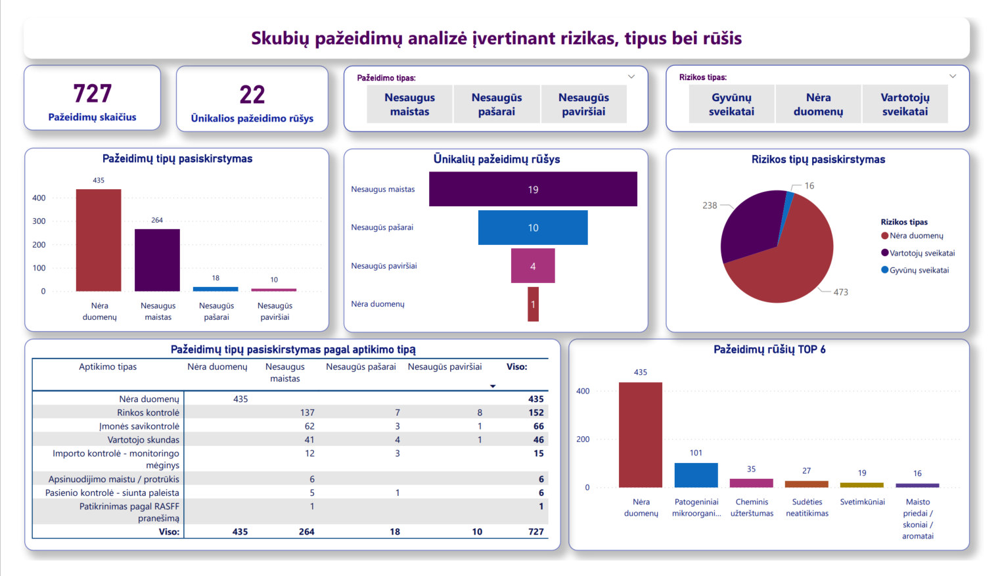
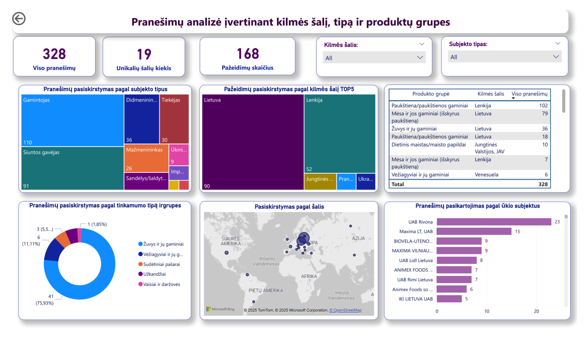

# 📊 RASFF – Skubūs pranešimai apie nesaugų maistą ir pašarus

## Projekto aprašymas
Šiame projekte analizuojami duomenys iš Europos Sąjungos greitojo įspėjimo sistemos dėl nesaugaus maisto ir pašarų (RASFF). Duomenų rinkinys apima informaciją apie nesaugių produktų pranešimus, siuntas, su jomis susijusius subjektus ir aptiktas rizikas.

Projektu siekiama:

- Išanalizuoti, kokios šalys dažniausiai inicijuoja RASFF pranešimus

- Išskirti dažniausiai pranešimuose pasikartojančius produktus bei rizikos veiksnius

- Įvertinti pranešimų tipus ir jų pokyčius laikui bėgant

- Sukurti interaktyvias vizualizacijas, leidžiančias efektyviai stebėti duomenų tendencijas

## Naudoti duomenys

- Šaltinis: [data.gov.lt/datasets/3817](data.gov.lt/datasets/3817)

- Licencija: Creative Commons Attribution 4.0

### Duomenų struktūra:

- Pranešimai: pranešimo data, pažeidimo aprašymas, rūšis, pavojus, tipas, aptikimo tipas, rizikos tipas ir kt.

- Siuntos informacija: produktas, grupė, kilmės šalis, partijos numeris, galiojimo terminas.

- Siuntos subjektai: subjekto pavadinimas, tipas (gamintojas, tiekėjas, gavėjas, importuotojas ir pan.), šalies kodas.

## Projekto tikslas

- Išanalizuoti dažniausiai pasitaikančias pažeidimų rūšis, produktų grupes, kilmės šalis ir susijusius ūkio subjektus.

- Įvertinti rizikos tipus, pažeidimų aptikimo būdus ir jų pasiskirstymą pagal įvairius pjūvius.

## Pagrindinės įžvalgos

- Dažniausios pažeidimų rūšys: patogeniniai mikroorganizmai, cheminis užterštumas, sudėties neatitikimas, svetimkūniai, maisto priedai.

- Daugiausia pranešimų susiję su paukštiena ir jos gaminiais (ypač iš Lenkijos), mėsa (Lietuva), žuvimis, dietiniais produktais (JAV).

- Daugiausia pažeidimų nustatoma rinkos kontrolės metu, taip pat per įmonių savikontrolę ir vartotojų skundus.

- Didžiausią dalį rizikų sudaro pavojai vartotojų sveikatai.

- Aktyviausi ūkio subjektai pagal pranešimų skaičių: UAB Rivona, Maxima LT, BIOVELA-UTENOS mėsa ir kt..

## Naudotos technologijos

- Power BI Desktop – duomenų vizualizacijoms kurti

- Power Query – duomenų valymui ir transformacijai

- DAX – KPI skaičiavimui, matavimų kūrimui

- Duomenų modeliavimas – ryšių tarp lentelių kūrimas

- Vizualizacijos: stulpelinės, skritulinės, linijinės diagramos, KPI kortelės, interaktyvūs filtrai

- Drill-down funkcionalumas - duomenų gilinimas nuo pranešimų pasikartojamumo iki pranešėjo tipo

## Kaip naudotis projektu

- Atsisiųskite projekto [failą](./priedai/dokumentai/Skubūs%20pranešimai%20apie%20nesaugų%20maistą%20ir%20pašarus.pbix).

- Atidarykite jį su Power BI Desktop.

- Peržiūrėkite ataskaitų skiltis: pažeidimų tipai, rizikos, produktų grupės, kilmės šalys, ūkio subjektai ir kt.
- Atsisiųskite projekto [pdf](./priedai/dokumentai/Skubūs%20pranešimai%20apie%20nesaugų%20maistą%20ir%20pašarus.pdf) failą ir peržiūrėkite.

## 📌 Pastabos

Šis projektas yra skirtas praktiniams Power BI įgūdžiams tobulinti. Duomenys yra iš viešai prieinamo šaltinio ir buvo naudojami tik edukaciniais tikslais.