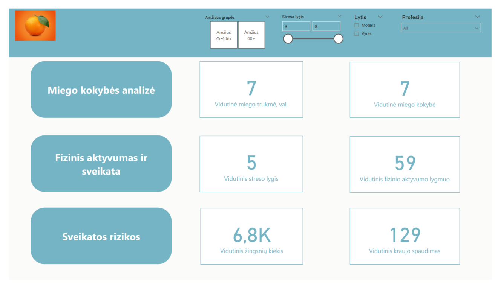
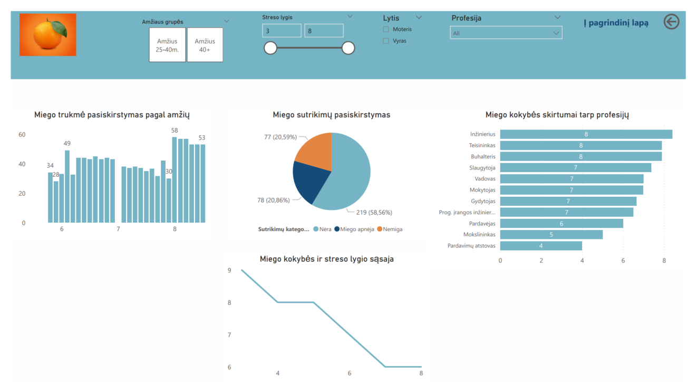
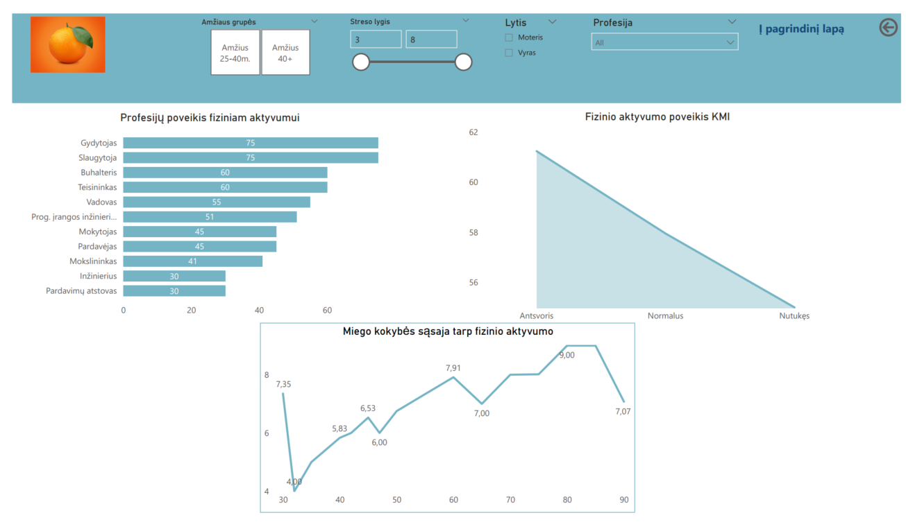
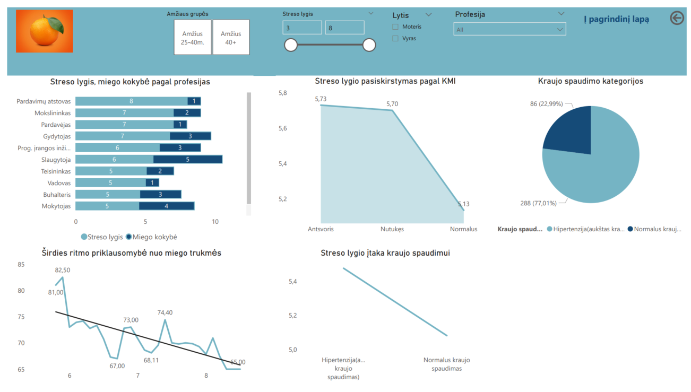

# 💤 Miego kokybės, sveikatos ir gyvenimo būdo analizė su Power BI

## 🔍 Projekto apžvalga

Šis projektas buvo sukurtas pasitelkus viešai prieinamą duomenų rinkinį, apimantį miego trukmę, miego kokybę, stresą, kraujo spaudimą, fizinį aktyvumą, KMI, profesiją, amžių ir kitus gyvenimo būdo rodiklius. Duomenys buvo gauti iš [Kaggle](https://www.kaggle.com) ir paruošti naudojimui Power BI aplinkoje.

📊 Vizualizacijos ir analizės tikslas – identifikuoti ryšius tarp gyvenimo būdo įpročių, profesinių veiksnių bei sveikatos ir miego kokybės rodiklių.

## 📈 Atlikti veiksmai

- Atliktas duomenų išvalymas ir transformacijos (Power Query);
- Sukurtas ryšių modelis tarp lentelių;
- Naudoti DAX skaičiavimai interaktyviems KPI ir vizualizacijoms;
- Sukurti segmentatoriai pagal lytį, amžių ir profesiją.

## 📌 Pagrindinės įžvalgos

- **Stresas ir miegas:** Didėjantis streso lygis susijęs su prastesne miego kokybe;
- **Profesijos įtaka:** Gydytojai ir slaugytojai dažniau susiduria su miego problemomis, jų fizinis aktyvumas didesnis nei kitų profesijų atstovų;
- **Amžius ir kraujo spaudimas:** Vyresnio amžiaus respondentai dažniau turi aukštą kraujo spaudimą, kuris susijęs su padidėjusiu stresu;
- **Fizinis aktyvumas ir KMI:** Aktyvesni asmenys dažniau turi normalų kūno masės indeksą;
- **Miego trukmė ir širdies ritmas:** Ilgesnis miegas koreliuoja su žemesniu vidutiniu širdies ritmu.

## 🛠️ Naudotos technologijos

- Power BI Desktop (DAX, Power Query)
- Duomenys iš Kaggle atviro duomenų rinkinio
- Vizualizacijos: stulpelinės, skritulinės, linijinės diagramos, KPI kortelės, interaktyvūs filtrai

## 🎯 Kas pasiekta

- Sukurtas interaktyvus prietaisų skydelis, leidžiantis tyrinėti miego, sveikatos ir gyvenimo būdo sąsajas pagal įvairius demografinius pjūvius;
- Praktikoje įtvirtinti Power BI įgūdžiai: duomenų modeliavimas, DAX, vizualizacijų kūrimas;
- Išmokta efektyviai pateikti analitinę informaciją ne techniniam vartotojui.
  

## 📂 Projekto failai

- [power bi](./priedai/dokumentai/Miego%20sveikatos%20ir%20gyvenimo%20būdo%20duomenų%20rinkinys.pbix)
- [pdf](./priedai/dokumentai/Miego%20sveikatos%20ir%20gyvenimo%20būdo%20duomenų%20rinkinys.pdf)
- Šis README failas